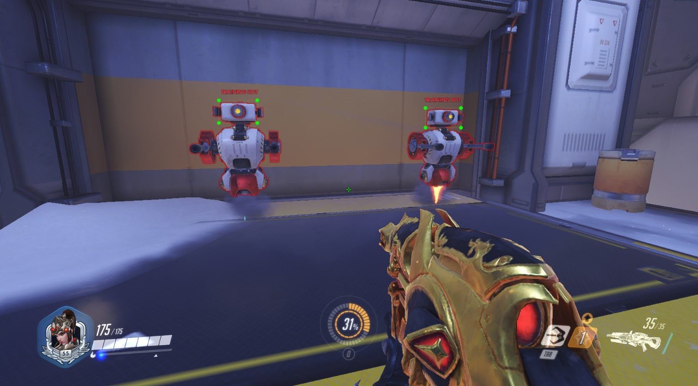

# Overwatch-AI-Aimbot

```

```

Object Detection with YOLO/MOBILENET architecture

2 Pretrained Models are included under Workspace/pre-trained-models:

1. SSD_MobileNet (320x320)
2. SSD_MobileNet (640x640)

Unzip these .tar.gz files using `unzip.py`

For more pretrained models, download at https://github.com/tensorflow/models/blob/master/research/object_detection/g3doc/tf2_detection_zoo.md

## Required Packages
1. Tensorflow Object Detection API: https://tensorflow-object-detection-api-tutorial.readthedocs.io/en/latest/install.html

2. LabelImg Tool: https://github.com/tzutalin/labelImg

3. Protocol Buffers: https://github.com/protocolbuffers/protobuf/releases

4. Pretrained Models: https://github.com/tensorflow/models/blob/master/research/object_detection/g3doc/tf2_detection_zoo.md

   

## preprocessImg.py
Used to rename image filenames in ascending order 
(E.g 1.png, 2.png, etc.)

You must rename the images first, before doing annotations using labelImg.py

```
python preprocessImg.py [--filepath]
```
--filepath: Folder containing images

E.g: `python processImg.py Workspace/images/screenshots`


## unzip.py

Used to unzip .tar.gz or .tar files. Useful for unzipping pretrained model files

```python
python unzip.py
```


## train.py
Used to process data train model
- Generated Tfrecords & labelmap will be in Workspace/annotataions
- Model weights will be saved to Workspace/my_model/{{CUSTOM_MODEL_NAME}}/


Will automatically
- Split images into train/test folders
- Edit pipeline.config file
- Create tfrecords from images
```
python train.py [-L --labels] [-E --epochs] [-N --name] [-T --split] [-s --trainSize] [-M --model]
```

>--labels: (str) Labels in json format. Must follow {'name': ..., 'id': ...} convention, where 'name' is the label given in labelImg.py tool.  
> Separate labels using triple asterix (E.g "{...}* * *{...}" )

>--epochs: (int) Number of training epochs to run

>--name: (str) Name of custom model 

>--split: (str; optional) `"yes"` or `"no"` (Defaults to 'no'). If "yes", will automatically split images & annotations in /screenshots folder, to /train and /test folder using trainSize 

>--trainSize: (float; optional) Training size (0-1, defaults to 1)

> --model: (str; optional) Pretrained model to use. Specify folder name containing pretrained model (located in Workspace/pre-trained-models/) 
>
> (Defaults to ssd_mobilenet_v2_fpnlite_320x320_coco17_tpu-8)

E.g: 
`python train.py -L "{'name': 'head', 'id': 1 }***{'name': 'body', 'id': 2 }" -E 50 -N "overwatch_mobnet" -T yes -S 0.7` -M "centernet_resnet50"

Internally, this will create:
- label=[{'name': 'head', 'id': 1 }, {'name': 'body', 'id': 2 }]
- Run for 50 epochs
- Create a model named "Overwatch_mobnet"
- Split the files in /screenshot folder, with 70% going to /train and the remaining 30% going to /test
- Train using the "centernet_resnet50" pretrained model, which can be found at Workspace/pre-trained-models/centernet_resnet50
- Run training for the model, where outputs can be found in my_models/overwatch_mobnet/


## testDetection.py

Used to test custom_model

```
python testDetection.py
```

